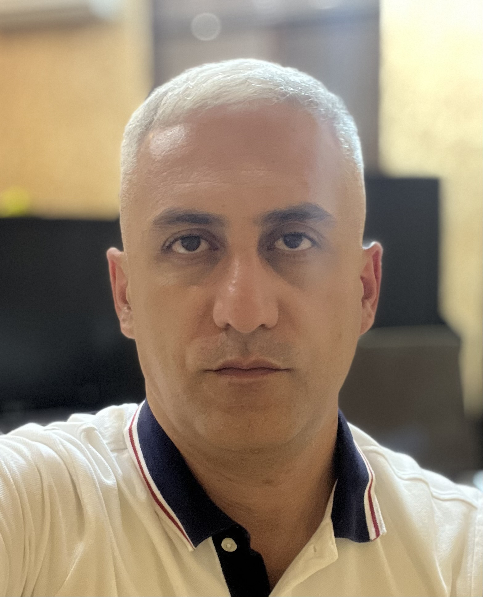

# Armen Kyureghyan

<!--  -->

---

### Contact Information:

**_Phone_**: +374 55 023010  
**_E-mail_**: armenschk@gmail.com  
**_Telegram_**: @armensch11 
[LinkdIn](https://www.linkedin.com/in/armen-kyureghyan-5090a71a4/)

---

### Summary

- 1 year of professional experience in the IT industry,
- Comprehensive understanding of IT industry, including software, hardware and networking,
- Proficient knowledge of JavaScript and popular JavaScript-based libraries,
- Solid experience with front-end development technologies (React JS, React-Redux, HTML, CSS, SASS),
- Thorough undestanding of software design principles and patterns,
- Deep understanding of OOP and Functional Programming,
- Good communication skills.

---

### Education

- [Udemy](https://www.udemy.com/) - _React - The Complete Guide (incl Hooks, React Router, Redux)_ - in progress.
- [ACA](https://www.aca.am/) - _Advanced JS and ReactJS_ in 2020
- **_IAEA_** course on Safety Assessement of Radioactive Waste Disposal, Abingdon, UK in 2002
- _State Engineering University of Armenia_, 2003

---

### Skills

- **Programming and Markup Languages**:
  - _JavaScript_
  - _ES2015/ES6_
  - _JSON_
  - _HTML5,CSS3_
- **Technologies and Frameworks**:
  - React
  - Redux-react
  - Firebase
  - OOP
  - Material UI
- **Development Environments**:
  - VS Code,
  - Linux
  - MacOS
  - VMware
  - VirtualBox
- **Continuous Integration and Repository Management**:
  - GitHub
- **Source Version Control**:
  - Git

---

### Languages

- _English_ - [EF SET Certificate](https://www.efset.org/cert/8FwP1X)
  

- _Armenian_ - native
- _Russian_ - like native
- _German_ - basic level
